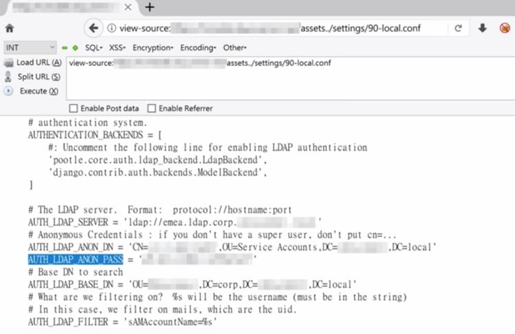

## Nginx Off Slash

**Nginx off slash** is a python script based in the [Orange Tsai](https://twitter.com/orange_8361) research presented at Hack.lu 2018.

The script aims to exploit the missing trailing slash in the Nginx configuration alias that could lead to sensitive files being accessed.

As an example, please, look at the following configuration alias code sample:
```
    location /assets {
        root /home/user/app;
    }
```

As a result, I'll link a screenshot below that I believe is worth more than any textual explanation.



Please, feel free to commit changes and open new issues.

# TODO:
 - Multi thread support
 - Output colorful (coz, why not!)
 - Profit ?